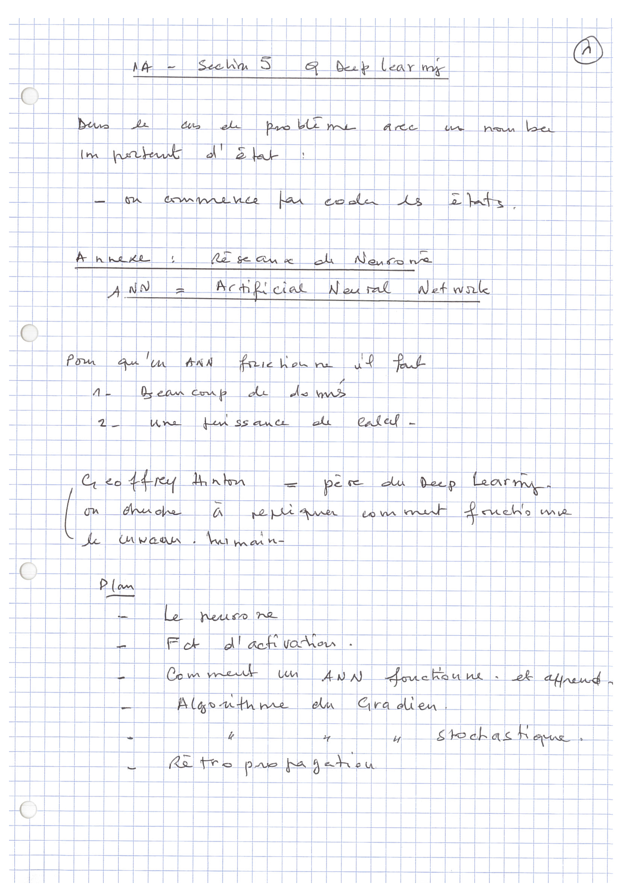
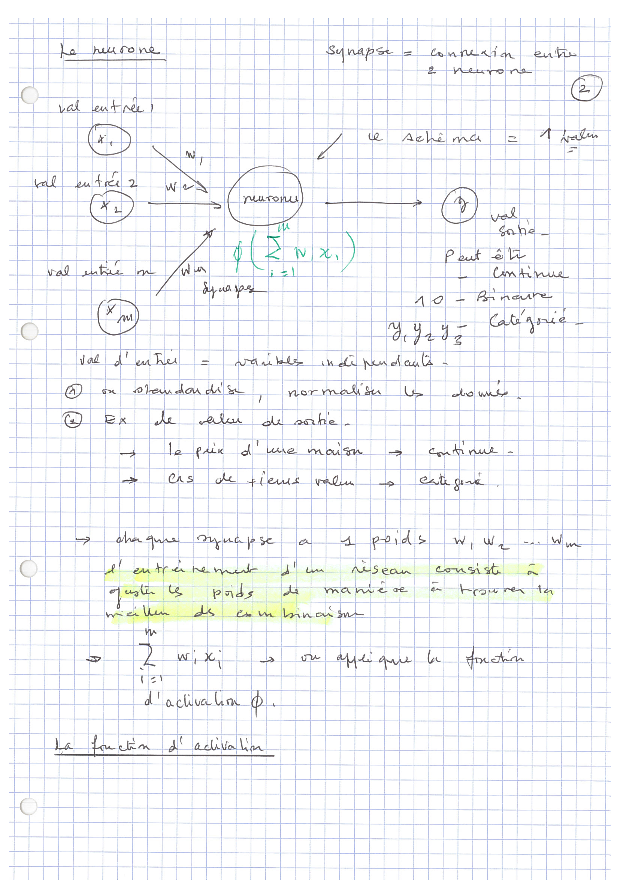
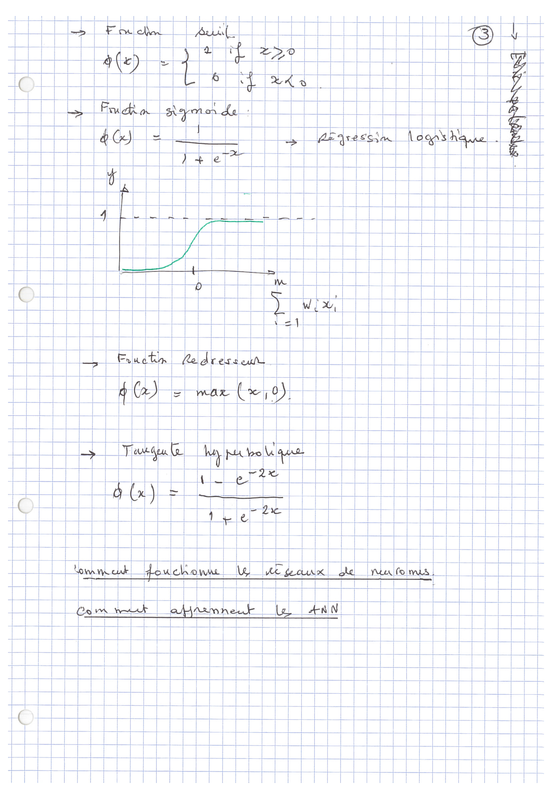
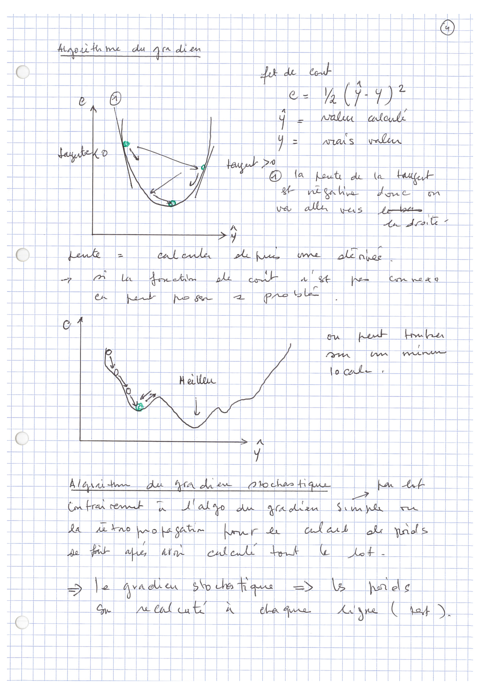
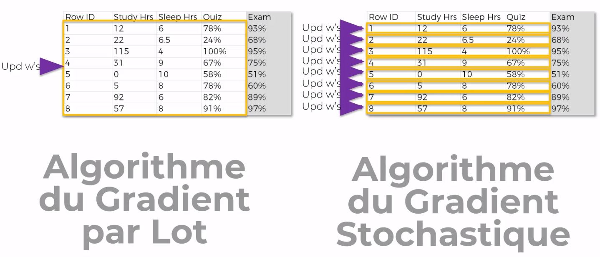
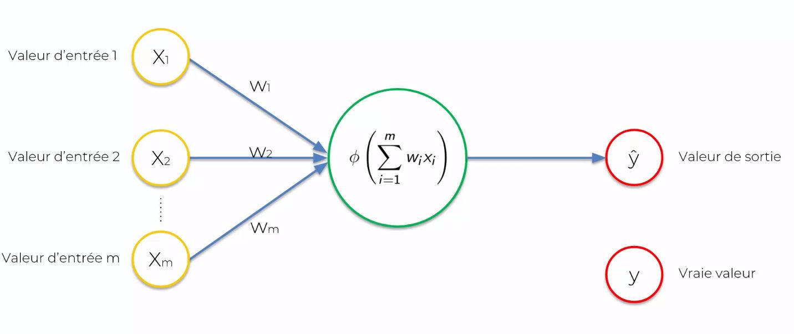
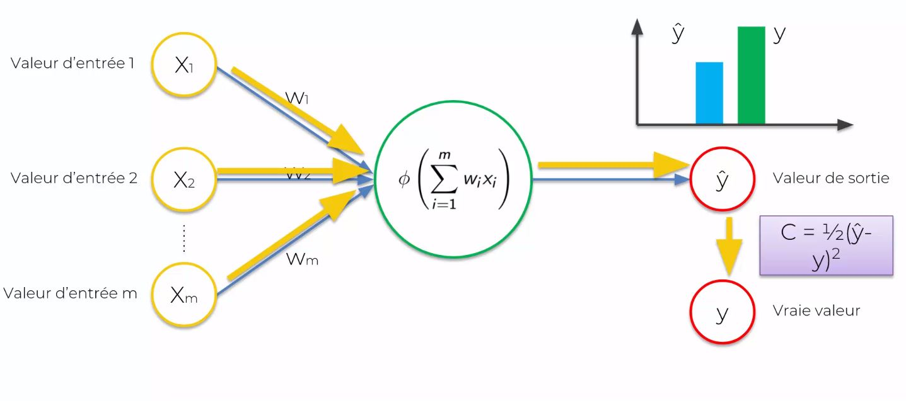
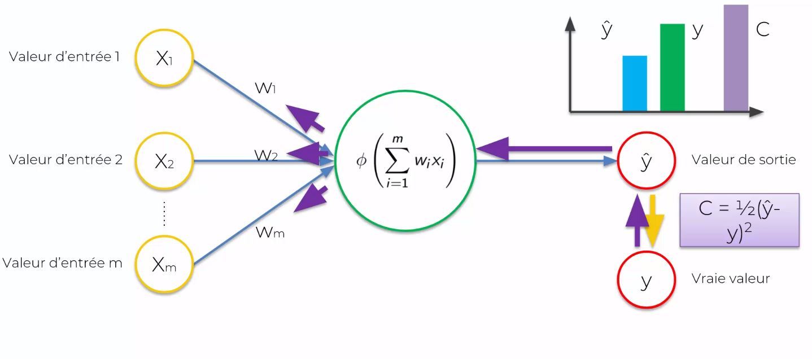
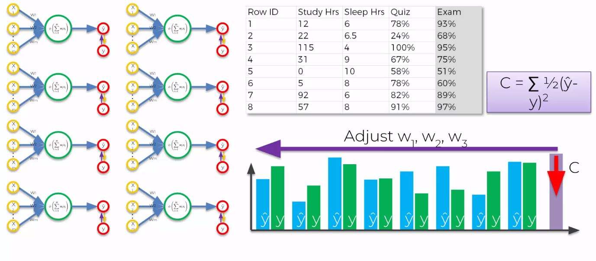
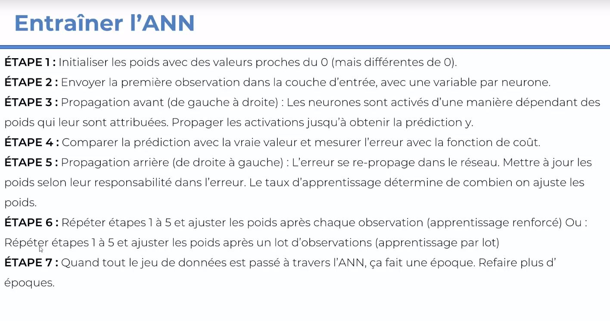

# Artifical Neuronal Network.

## Notes

## Comment Apprends un ANN

## Récap methodologie 

## Additional Resources

### A list of cost functions used in neural networks, alongside applications
- https://stats.stackexchange.com/questions/154879/a-list-of-cost-functions-used-in-neural-networks-alongside-applications

### A Neural Network in 11 lines of Python (Part 1)
- https://iamtrask.github.io/2015/07/12/basic-python-network/
### A Neural Network in 13 lines of Python (Part 2 - Gradient Descent)
-- https://iamtrask.github.io/2015/07/27/python-network-part2/

### Neural Networks and Deep Learning
- http://neuralnetworksanddeeplearning.com/
